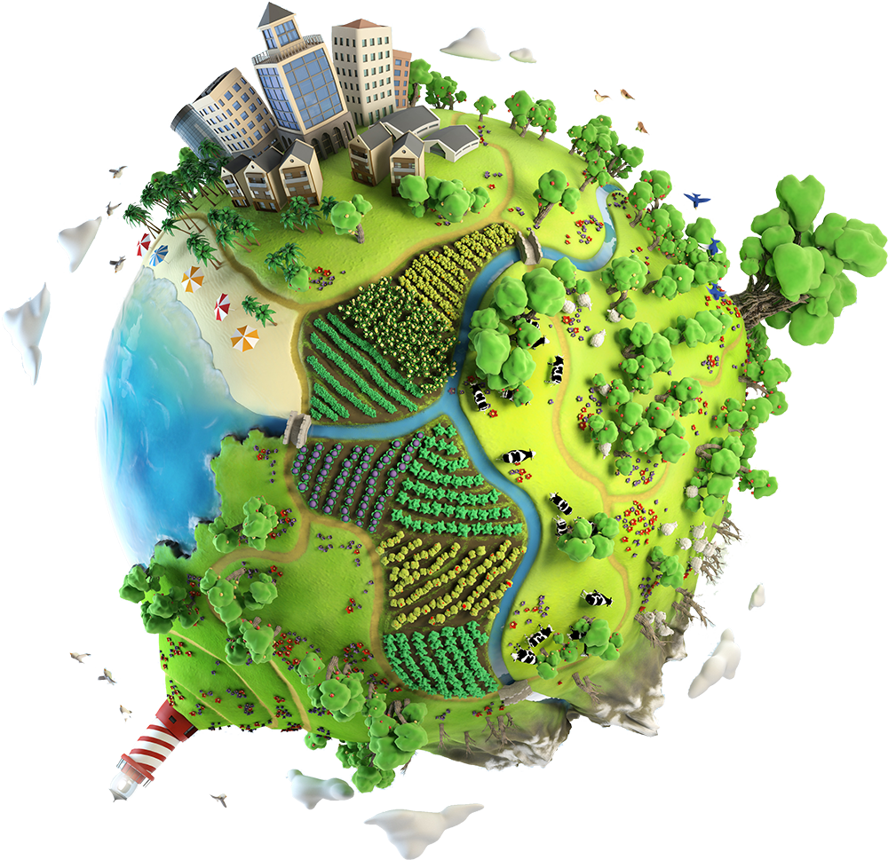

#  Geospatial Analysis
## Description
Conducted an extensive geospatial analysis on Zomato's customer data,
utilizing GIS tools like Folium and Plotly to map customer density,
restaurant locations. Conducted cluster analysis providing actionable insights for optimizing restaurant marketing.

## Screenshots

     
     

     
     

     
     
     

     
     

## Tech Stack

